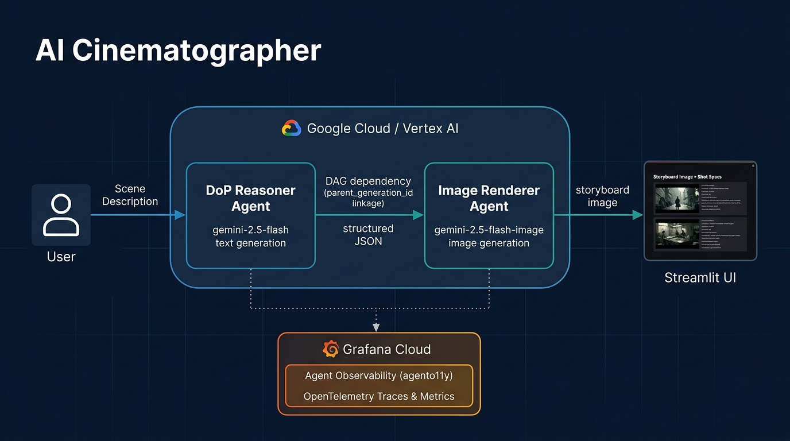
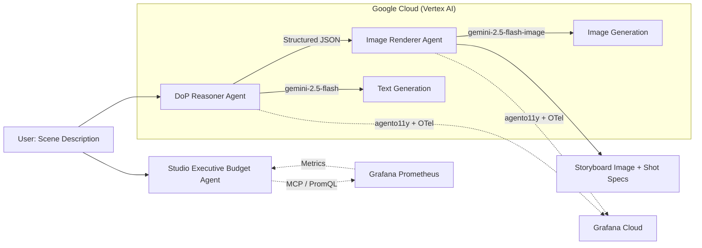

# 🎬 AI Cinematographer — Pre-Production Engine

[](LICENSE)

An intelligent agentic pre-production studio that transforms narrative scene descriptions into technically precise camera setups, lighting designs, and photorealistic storyboard images — powered by **Google Gemini** on **Vertex AI** with production-grade observability via **Grafana Agent Observability**.

> **Agentic Cinema Hackathon** — Grafana Labs Partner Track

---
## LIVE app
https://ai-cinematographer-1071855107814.us-central1.run.app/

## 🌟 Features

- **Director of Photography (DoP) Reasoning** — Uses `gemini-2.5-flash` with structured Pydantic output to translate narrative scenes into focal lengths, camera angles, lighting ratios, and composition instructions.
- **Storyboard Image Rendering** — Leverages `gemini-2.5-flash-image` (Gemini native image generation) to instantly visualize the shot from the DoP's technical specs.
- **Full Grafana Observability Pipeline**:
  - **Agent Observability (agento11y)** — Tracks multi-agent interactions, model IDs, latency, and DAG dependency relationships between the DoP reasoner and image renderer. Includes **Custom Evaluators** for safety and quality (e.g., *prompt_injection_detection*, *cinematic_feasibility*).
  - **OpenTelemetry Traces & Metrics** — Distributed span hierarchies and `gen_ai.client.*` metrics exported to Grafana Cloud via OTLP.
- **Grafana MCP Integration (Budget Agent)** — An autonomous "Studio Executive" agent powered by the Model Context Protocol (MCP) that queries Grafana Prometheus metrics in real-time to monitor token usage and estimate operational costs.
- **Streamlit Web UI** — Side-by-side visualization of generated storyboards, technical shot specifications, and executive budget reports.

---

## 🏗️ Architecture



<details>
<summary>View as text diagram</summary>


</details>

### Project Structure

```
ai-cinematographer/
├── Dockerfile                   # Cloud Run deployment
├── .env.example                 # Environment variable template
├── requirements.txt             # Python dependencies
├── LICENSE                      # MIT License
├── tests/
│   └── test_instrumentation.py  # Multi-agent observability tests
└── src/
    ├── __init__.py
    ├── config.py                # Centralized environment config
    ├── schemas.py               # Pydantic data contracts & DoP system prompt
    ├── telemetry.py             # OpenTelemetry & agento11y initialization
    ├── agent.py                 # Multi-agent pipeline (DoP reasoning → image gen)
    ├── budget_agent.py          # MCP Grafana Integration for cost monitoring
    └── app.py                   # Streamlit presentation layer
```

---

## 🤖 Multi-Agent Identity & Observability

The pipeline separates generation tasks into distinct, accountable agent roles tracked in Grafana Cloud:

| Role | Agent Name | Model | Parent Linkage |
| :--- | :--- | :--- | :--- |
| **DoP Reasoning** | `cinematographer-dop-reasoner` | `gemini-2.5-flash` | None (Root) |
| **Storyboard Rendering** | `storyboard-image-renderer` | `gemini-2.5-flash-image` | `[dop_generation_id]` |
| **Budget Monitor** | `budget-executive-agent` | MCP Grafana Server | None |

### Custom AI Evaluators
The project leverages Grafana Agent Observability **Evaluators** to ensure the quality and safety of the generated content:
- `prompt_injection_detection`: Ensures the user isn't trying to hijack the DoP prompt.
- `cinematographer_dop_reasoner_fulfillment`: Verifies the DoP agent correctly outputted all technical fields.
- `hallucination_detector`: Ensures the generated image prompt aligns with the user's original scene description.
- `cinematic_feasibility`: Checks if the camera equipment requested actually exists and is physically possible to rig.
- `response_not_empty`: Basic fallback check to ensure outputs aren't dropped.

---

## 🔌 Grafana MCP Integration

We implemented the **Grafana MCP Server** (Model Context Protocol) to create an autonomous "Studio Executive" Budget Agent.
This agent runs as a subprocess when a scene is generated, using the MCP `query_prometheus` tool to execute real-time PromQL queries against Grafana Cloud. It pulls `gen_ai.client.token.usage` OpenTelemetry metrics, parses the timeseries JSON payload, and formats it into a Markdown cost-estimation table directly inside the Streamlit UI.

---

## 🚀 Getting Started

### Prerequisites

- Python 3.11+
- A Google Cloud project with Vertex AI API enabled
- Google Cloud CLI (`gcloud`) installed and authenticated
- A Grafana Cloud account with Agent Observability enabled
- A Grafana Service Account Token (Viewer role) for MCP

### 1. Clone the Repository

```bash
git clone https://github.com/hasanulkarim/ai-cinematographer.git
cd ai-cinematographer
```

### 2. Set Up Environment

```bash
python -m venv venv
source venv/bin/activate  # On Windows: venv\Scripts\activate
pip install -r requirements.txt
```

### 3. Configure Environment Variables

```bash
cp .env.example .env
# Edit .env with your actual credentials
```

See [`.env.example`](.env.example) for all required variables.

### 4. Authenticate with Google Cloud

```bash
gcloud auth application-default login
gcloud config set project YOUR_PROJECT_ID
```

### 5. Run Locally

```bash
streamlit run src/app.py
```

### 6. Run Tests

```bash
pytest tests/test_instrumentation.py -v
```

---

## ☁️ Deploy to Google Cloud Run

```bash
gcloud run deploy ai-cinematographer \
  --source . \
  --region us-central1 \
  --allow-unauthenticated \
  --port 8501
```

After deployment, set your environment variables in the Cloud Run service settings (Google Cloud Console → Cloud Run → ai-cinematographer → Edit & Deploy New Revision → Variables & Secrets).

You will receive an HTTPS URL (e.g., `https://ai-cinematographer-xyz.a.run.app`).

---

## ⚙️ Environment Variables

| Variable | Description |
| :--- | :--- |
| `USE_VERTEXAI` | Set to `true` for Vertex AI, `false` for Gemini Developer API |
| `GOOGLE_CLOUD_PROJECT` | Your GCP project ID |
| `GOOGLE_CLOUD_LOCATION` | GCP region (default: `us-central1`) |
| `GEMINI_API_KEY` | Only needed if `USE_VERTEXAI=false` |
| `AGENTO11Y_ENDPOINT` | Grafana Agent Observability endpoint |
| `AGENTO11Y_AUTH_TENANT_ID` | Grafana Cloud tenant ID |
| `AGENTO11Y_AUTH_TOKEN` | Grafana Cloud API token (Cloud Access Policy) |
| `OTEL_EXPORTER_OTLP_ENDPOINT` | OTLP gateway endpoint for traces/metrics |
| `OTEL_EXPORTER_OTLP_HEADERS` | Authorization header for OTLP export |
| `GRAFANA_URL` | Your Grafana Instance URL (e.g. `https://my.grafana.net/`) |
| `GRAFANA_API_TOKEN` | Grafana Service Account Token (`glsa_...`) for MCP |

---

## 📊 Observability Verification

- **Grafana Agent Observability**: Navigate to **Grafana Cloud → AI Observability → Agents / Conversations** to filter by `cinematographer-dop-reasoner` and `storyboard-image-renderer`.
- **OTel Traces & Spans**: View distributed traces in Grafana Tempo with spans:
  - `generate_cinematic_package` (orchestration)
  - `llm_reasoning_gemini_flash` (DoP reasoning)
  - `image_generation_nano_banana` (image rendering)

---

## 📝 License

This project is licensed under the MIT License — see the [LICENSE](LICENSE) file for details.

---

## 🏆 Hackathon

Built for the [Agentic Cinema Hackathon](https://agentic-cinema.devpost.com/) — **Grafana Labs Partner Track**.

**Tech Stack**: Google Gemini (Vertex AI) · Grafana Agent Observability (agento11y) · OpenTelemetry · Model Context Protocol (MCP) · Streamlit · Google Cloud Run
